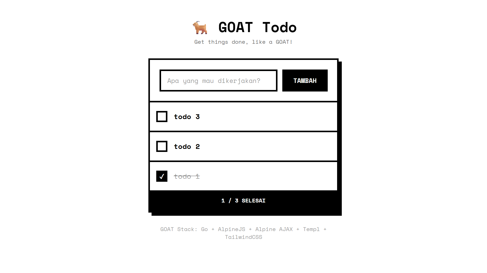

# 🐐 GOAT Todo

Aplikasi Todo List modern dengan arsitektur Clean Architecture, dengan techstack super ringan yaitu GOAT stack:

`Go`
`AlpineJS`
`Alpine AJAX`
`Templ`
`TailwindCSS`



## Fitur

- Tambah, toggle, dan hapus todo
- SPA-like experience tanpa page reload (Alpine AJAX)
- Hot reload untuk development
- Clean Architecture untuk maintainability

## Tech Stack

| Kategori | Teknologi |
|----------|-----------|
| **Backend** | Go, Templ |
| **Frontend** | AlpineJS, Alpine AJAX, TailwindCSS |
| **Database** | SQLite |
| **Dev Tools** | Air (hot reload), Make |

## Struktur Proyek

```
goat-todo/
├── cmd/server/           # Entry point aplikasi
├── internal/
│   ├── domain/           # Entity & Repository interface
│   ├── app/              # Business logic / Use cases
│   ├── infra/            # Database implementation
│   └── handler/          # HTTP handlers & Templates
├── Makefile
└── .air.toml             # Hot reload config
```

## Cara Menjalankan

### 1. Clone Repository

```bash
git clone https://github.com/muhmuslimabdulj/goat-todo.git
cd goat-todo
```

### 2. Install Dependencies

```bash
# Install Templ
go install github.com/a-h/templ/cmd/templ@latest

# Install Air (untuk hot reload, opsional)
go install github.com/air-verse/air@latest
```

### 3. Generate & Run

```bash
# Generate templ files
templ generate

# Jalankan dengan hot reload
make dev

# Atau tanpa hot reload
make run
```

### 4. Buka Browser

```
http://localhost:8080
```

## Arsitektur

Proyek ini menggunakan **Clean Architecture**:

```
┌─────────────────────────────────────┐
│           HTTP Handlers             │  ← Interface Layer
├─────────────────────────────────────┤
│           Todo Service              │  ← Application Layer
├─────────────────────────────────────┤
│      Todo Entity & Interface        │  ← Domain Layer
├─────────────────────────────────────┤
│         SQLite Repository           │  ← Infrastructure Layer
└─────────────────────────────────────┘
```

## Lisensi

MIT License
